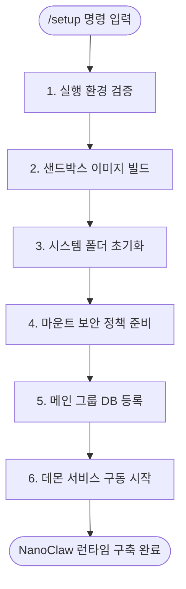
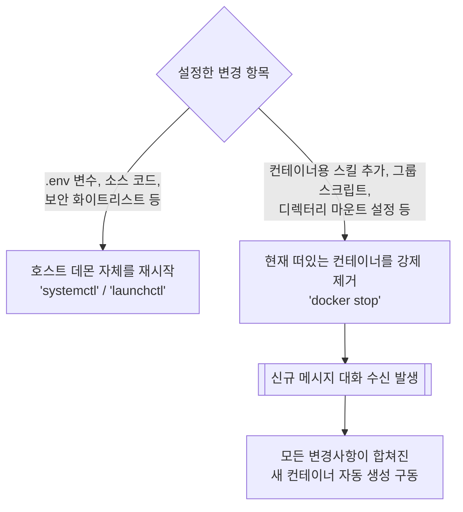

# /setup 동작 과정 및 컨테이너 재설정 적용 가이드

이 문서는 NanoClaw의 초기 설치를 담당하는 `/setup` 명령어의 핵심 동작 과정을 이해하고, 이후 설정이 변경되었을 때 컨테이너 및 호스트 시스템을 재실행하여 변경 사항을 적용하는 방법을 요약합니다.

---

## 1. `/setup` 명령어의 핵심 동작 과정

사용자가 `claude` (Claude Code) 프롬프트 안에서 `/setup` 명령어를 입력하면, 백그라운드에서 스킬(`setup/index.ts`)이 호출되어 아래의 6단계를 거쳐 NanoClaw 구동 환경을 자동 구축합니다.



1. **실행 환경 검증 (Environment Check)**: 
   - Node.js 버전(20 이상)이 최신인지 검사합니다.
   - 컨테이너 런타임(Docker 엔진 또는 macOS의 Apple Container)이 정상 실행 중인지 확인합니다.

2. **샌드박스 이미지 빌드 (Container Build)**: 
   - `./container/Dockerfile`을 기반으로 에이전트가 동작할 격리 샌드박스 이미지(`nanoclaw-agent:latest`)를 생성(빌드)합니다.

3. **시스템 폴더 초기화 (Groups Init)**: 
   - 에이전트들의 영구 기억이 담길 전체 공통 디렉터리(`groups/global/`)와 메인 관리자 채널(`groups/main/`) 핵심 파일 구조를 생성합니다.

4. **마운트 보안 정책 준비 (Mounts)**: 
   - 컨테이너가 접근 가능한 호스트 외부 디렉터리를 통제하는 보안 화이트리스트(`~/.config/nanoclaw/mount-allowlist.json`) 템플릿을 생성합니다.

5. **메인 그룹 DB 등록 (Register)**: 
   - 로컬 SQLite 데이터베이스(`store/messages.db`)를 구축합니다.
   - 사용자가 스캔한 WhatsApp 인증 세션을 저장하고 메인 채팅 채널을 시스템에 등록합니다.

6. **시스템 데몬 서비스 구동 (Service Start)**: 
   - 호스트 오케스트레이터(NanoClaw)를 상시 구동하기 위해 운영체제의 백그라운드 서비스(macOS: `launchd`, Linux: `systemd` 등)로 활성화하고 기동합니다.

---

## 2. 설정 변경 후 컨테이너 및 호스트 재실행(반영) 방법

NanoClaw는 항시 켜져 있는 **'호스트 데몬'**과 대화 시에만 생성되는 1회성 **'컨테이너 에이전트'**로 구성되어 있습니다. 변경한 설정 항목에 따라 재시작해야 할 주체가 다릅니다.



### A. 호스트 데몬 재시작이 필요한 경우
백그라운드에서 전체 시스템을 관장하는 데몬 프로세스 자체를 재시작해야 하는 설정들입니다.

* **변경 대상**: 
  - API 키나 토큰 변경 (`.env`)
  - 마운트 보안 기본 화이트리스트(`mount-allowlist.json`) 정책 변경
  - NanoClaw 코어 소스 코드(`src/*`) 업데이트
  - 신규 포트 바인딩 및 메신저 연동 등
* **적용 방법**:
  ```bash
  # Linux (systemd 기반)
  systemctl --user restart nanoclaw
  
  # macOS (launchctl 기반)
  launchctl kickstart -k gui/$(id -u)/com.nanoclaw
  ```

### B. 컨테이너 에이전트 재실행이 필요한 경우
대부분의 기능 확장은 그룹별로 일회성 생성되는 컨테이너가 담당합니다. 컨테이너는 30분 이상 대화가 없으면 어차피 소멸 후 새로 태어나지만, 당장 설정을 적용하고 싶다면 기존 컨테이너를 수동으로 강제 종료시켜야 합니다.

* **변경 대상**:
  - 그룹별 커스텀 툴/로직 변경 (`data/sessions/{folder}/agent-runner-src/` 내 TypeScript 수정 시)
  - 모든 사용자용 스킬 추가 (`container/skills/`)
  - 특정 시스템 지시사항 (`CLAUDE.md`) 업데이트 및 DB(`registered_groups`) 추가 마운트 반영
* **적용 원리**: 
  - 기존에 메모리를 물고 떠 있던 컨테이너를 강제 제거합니다. 
  - 이후 새 메시지가 들어오면 NanoClaw 데몬이 자동으로 새로운 옵션과 빌드 상태를 합쳐 신규 컨테이너를 구동시킵니다.
* **적용 방법**:
  ```bash
  # 실행 중인 모든 NanoClaw 컨테이너를 안전하게 강제 종료
  docker ps -q --filter "name=nanoclaw-" | xargs -r docker stop
  ```

### C. (권장) 좀비 컨테이너를 방지하는 '안전한 전체 재시작'
과거 데몬(Host) 프로세스가 비정상 종료되거나 통신 타임아웃으로 강제 재시작될 때, 기존에 떠 있던 도커 컨테이너가 죽지 않고 고아(Orphan) 상태로 남아있어 **신규 생성된 컨테이너와 함께 중복으로 실행되며 메시지를 훔쳐가는(가로채는) 장애**가 발생한 이력이 있습니다.

따라서 호스트 환경을 재구성하거나 꼬인 스레드를 복구할 때는 아래의 순서대로 **안전한 재시작(Safe Restart)**을 수행하는 것을 권장합니다.

1. **기존 컨테이너 모두 사살 (중복 실행 방지)**:
   ```bash
   docker ps -q --filter "name=nanoclaw-" | xargs -r docker stop
   ```
2. **호스트 데몬 프로세스 재기동**:
   ```bash
   systemctl --user restart nanoclaw  # Linux
   # 또는
   launchctl kickstart -k gui/$(id -u)/com.nanoclaw  # macOS
   ```
이렇게 조치하면 남겨진 좀비/중복 컨테이너 없이 완벽하게 초기화된 1개의 깨끗한 호스트-컨테이너 연결 환경이 보장됩니다.
